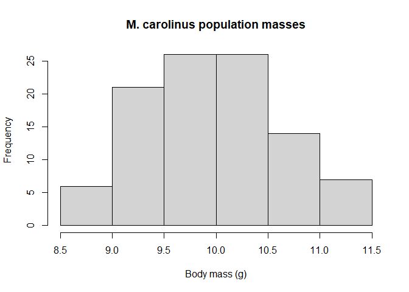

<!-- README.md is generated from README.Rmd. Please edit that file -->

# birdsize

<!-- badges: start -->

[](https://codecov.io/gh/diazrenata/birdsize?branch=main)

[](https://www.repostatus.org/#wip)

[](https://github.com/diazrenata/birdsize/actions?query=workflow%3Apkgcheck)

[](https://github.com/ropensci/software-review/issues/577)
<!-- badges: end -->

## Package summary

`birdsize` simulates size measurements for populations or communities of
birds. Because avian populuation monitoring often relies on auditory or
visual methods, and therefore does not provide information about
individual body *size*, it is challenging to conduct large-scale
analyses of trends in biomass, energy use, community body size
structure, or other, similar patterns for these species. `birdsize`
solves this problem by using species’ traits to generate size estimates
for birds based on species ID or user-specified parameters. It is
designed to interface naturally with data downloaded from the [North
American Breeding Bird Survey](https://www.pwrc.usgs.gov/bbs/), or to
work with other datasets (including synthetic data) as long as they
include *population sizes* and either *species identity* (for species
found in the Breeding Bird Survey) or *species mean, and optionally
standard deviation, body size* (for other species, including
hypothetical or simulated species).

The core functions in `birdsize` apply at 3 levels of organization:
species, population, and community. The `population_*` functions use
species-level parameters (mean and standard deviation of body mass) and
population sizes to simulate individual body size and basal metabolic
rate measurements to make up populations of that species, by drawing
from normal distributions. The `species_*` functions - which are, for
the most part, used under-the-hood by the `population_*` and
`community_*` functions - take information about a real or hypothetical
species and either looks up or estimates the parameters necessary to
simulate body size distributions for that species. The `community_*`
functions generate population-level estimates for numerous populations
(e.g. populations of different species, or populations of the same
species at different points in time or different sampling locations).

## Sample use cases

### Installation

To install the in-development version:

``` r
devtools::install_github('diazrenata/birdsize')
```

``` r
library(birdsize)
```

### Estimating body masses for a single population

The core functionality of `birdsize` is to simulate individual body mass
measurements for birds given either their species ID or a mean (and
possibly standard deviation) of body mass, by drawing individuals from a
normal distribution. At minimum, this requires a population size
(abundance) and either the species’ mean body size, or the species’
identifier (scientific name, or [AOU code]() for species found in the
BBS. If the standard deviation of body mass is not provided, `birdsize`
will estimate it based on a scaling relationship between the mean and
standard deviation of body mass.

The key function for this is `pop_generate`.

Here, we generate body mass estimates for a population of a hypothetical
species with a mean body size of 10g:

``` r
set.seed(13)

first_population <- pop_generate(abundance = 100,
                                 mean_size = 10)

hist(first_population$individual_mass,
     main = "First population masses", 
     xlab = "Body mass (g)")
```


Alternatively, for a species known to `birdsize`, we can simply provide
the scientific name or AOU code. Here, *Melanerpes carolinus* is the
red-headed woodpecker:

``` r


woodpecker_population <- pop_generate(abundance = 100,
                                 scientific_name = "Melanerpes carolinus")

hist(first_population$individual_mass,
     main = "M. carolinus population masses", 
     xlab = "Body mass (g)")
```



### Estimating over a whole community

To generate body size estimates for a whole community, we use the
`community_generate` function. `community_generate` takes population
sizes and species identifiers or parameters for multiple species, and
simulates populations for each species.

We can create estimates for a community without species codes by
providing population sizes and mean body sizes:

``` r

first_community <- data.frame(
  abundance = c(50, 100, 150),
  mean_size = c(200, 50, 10)
)

first_community_sims <- community_generate(first_community, abundance_column_name = "abundance")

hist(first_community_sims$individual_mass, main = "Community body size distribution", xlab = "Body mass", breaks = 50)
```


``` r


community_sims <- community_generate(demo_route_clean, abundance_column_name = "speciestotal")

hist(community_sims$individual_mass, main = "Community body size distribution", xlab = "Body mass", breaks = 50)
```


## `birdsize` and the Breeding Bird Survey

`birdsize` was originally developed to be applied to the North American
Breeding Bird Survey (BBS). In brief, the North American Breeding Bird
Survey is a community science program run by the USGS for more than 60
years. Each year, during the avian breeding season, volunteer surveyors
conduct auditory point-counts of all the birds observed along 50-km
routes. There are nearly 3,000 such routes distributed across the United
States and Canada, making the BBS an invaluable dataset on avian
populations and community structure over time and over large geographic
extents. For more detail on the BBS, and to access the BBS data, see the
Breeding Bird Survey [website](https://www.pwrc.usgs.gov/bbs/) and
[repository on ScienceBase](https://doi.org/10.5066/P9J6QUF6).

To facilitate applications to the BBS, `birdsize` contains built-in
species parameters for 450 species found in the BBS from 1980 until
present, and contains built-in “demo” datasets that mimic the structure
of the BBS data. The [bbs-data]() vignette illustrates how to use
`birdsize` to generate estimates of biomass and energy use for a route
from the Breeding Bird Survey.

Note, however, that `birdsize` does not contain any actual data from the
Breeding Bird Survey. There are multiple interfaces for connecting to
the BBS data releases (e.g. the R Data Retriever, ScienceBase) and,
wherever possible, users are encouraged to go directly to the source to
access the most up-to-date data.

## Citation

Diaz, Renata M. (2023). birdsize: Estimate Avian Body Size
Distributions. GitHub. <https://github.com/diazrenata/birdsize>
